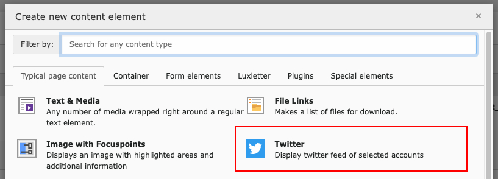

# XIMA TYPO3 Twitter client

This extension uses the Twitter v2 API to download and display tweets.

To use the Twitter API, you need a developer account, register your application and obtain

* consumer key
* consumer secret
* api key
* api secret

## Installation

1. Install via composer

    ```bash
    composer require xima/xima-twitter-client
    ```

2. Include TypoScript setup + constants

    ```typo3_typoscript
    @import 'EXT:xima_twitter_client/Configuration/TypoScript/setup.typoscript'
    ```

3. Include PageTS

    ```typo3_typoscript
    @import 'EXT:xima_twitter_client/Configuration/TSconfig/page.tsconfig'
    ```

4. Enter the credentials in extension configuration

    ````php
    $GLOBALS['TYPO3_CONF_VARS']['EXTENSIONS']['xima_twitter_client']['access_key'] = '',
    $GLOBALS['TYPO3_CONF_VARS']['EXTENSIONS']['xima_twitter_client']['access_secret'] = '',
    $GLOBALS['TYPO3_CONF_VARS']['EXTENSIONS']['xima_twitter_client']['api_key'] = '',
    $GLOBALS['TYPO3_CONF_VARS']['EXTENSIONS']['xima_twitter_client']['api_secret'] = '',
    $GLOBALS['TYPO3_CONF_VARS']['EXTENSIONS']['xima_twitter_client']['image_storage'] = '1:Images/Twitter',
    ````

## Configuration

1. Create a new SysFolder that includes the module "twitter"
2. Add a new "Account" record inside this folder
3. Enter a Twitter account name you want to fetch tweets from

## Usage

To start the download, run this command:

```bash
vendor/bin/typo3cms twitter:fetchTweets
```

To output a Twitter feed, add the new custom content element "Twitter" to any page:


